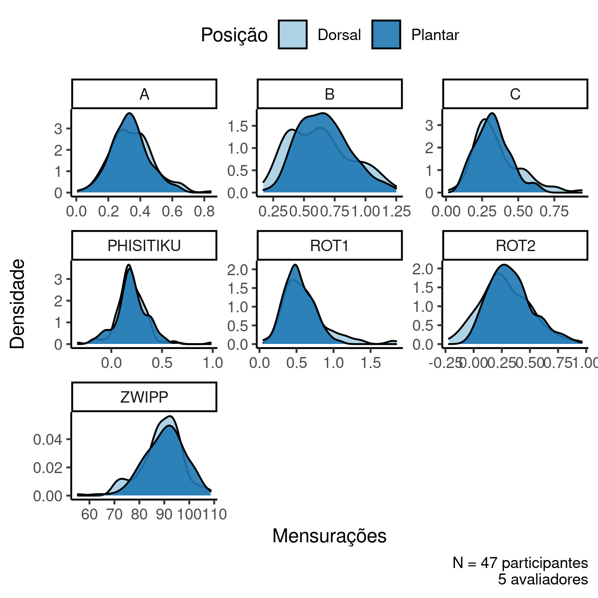

```{r setup, include=FALSE}
knitr::opts_chunk$set(echo = FALSE)
knitr::opts_knit$set(root.dir = normalizePath(".."))
options(scipen = 999)
library(pander)
library(knitr)
panderOptions('table.style', 'rmarkdown')
panderOptions('table.split.table', 160)
```

---

\newpage

**Consistência de mensurações radiológicas para diagnóstico de sindesmose**

**Histórico do documento**

```{r history}
Version <- c("01")
Changes <- c("Versão inicial")
history <- cbind(Version, Changes)
colnames(history) <- c("Versão", "Alterações")
# pander(history, split.cells = 70)
kable(history)
```

```{r results, include=FALSE}
source("scripts/results.R", encoding = 'UTF-8')
```

---

# Lista de abreviaturas

- CV: coeficiente de variação
- DP: desvio padrão
- IC: intervalo de confiança
- ICC: Correlação intra-classe (*intra-class correlation*)

# Contexto

## Objetivos

Avaliar
consistência intra- e inter-avaliador de mensurações radiográficas
para diagnóstico de sindesmose tibiofibular distal,
em tornozelos normais,
nas posições de flexão dorsal 15 graus e flexão plantar 20 graus,
através de cortes tomográficos no plano axial.

## Recepção e tratamento dos dados

A base de dados original possuía
`r Nvar_orig`
variáveis coletadas de
`r Nobs_orig`
observações.

As distâncias A, B e C foram mensuradas conforme segue:

- Distância A = entre o ponto mais anterior da incisura e o ponto mais anterior da fíbula;
- Distância B = entre o ponto mais posterior da incisura até o ponto mais posterior da fíbula;
- Distância C = menor distância entre a tíbia e a fíbula, medida no ponto médio da incisura.

Todas as mensurações foram realizadas por 5 avaliadores independentes, em duas posições (dorsal e plantar).
Com base nas distâncias A, B e C foram calculados os parâmetros:

- Rotação 1 = $A / B$
- Rotação 2 = $B - A$
- Translação lateral = $C$

Após os cálculos dos parâmetros de rotação e translação, a tabela de dados foi redesenhada de modo que todas as mensurações estejam dispostas em uma única coluna, com as posições dorsal e plantar identificadas em uma variável categórica.

Depois dos procedimentos de limpeza e seleção
`r Nvar_final`
variáveis foram incluídas na análise com
`r Nobs_final`
observações.

# Metodologia

## Parâmetros do estudo

### Desenho do estudo

Observacional, com coleta de dados transversal.

### Critérios de inclusão e exclusão

N/A

### Exposições

N/A

### Desfechos

Esta análise não avaliará desfecho clínico, portanto não há desfecho a ser definido.

### Covariáveis

Não foram coletados dados demográficos e clínicos dos participantes de pesquisa.

## Análises Estatísticas

As mensurações referentes às medidas de rotação e translação lateral da fíbula
foram descritas como
média (DP).
As distribuições das mensurações foram resumidas em tabelas e visualizadas em gráficos exploratórios
Todas as comparações entre as mensurações foram avaliadas como análises univariadas.
As análises foram feitas agrupando-se as medidas de rotação e translação lateral da fíbula por avaliador e por tipo de mensuração.
A consistência das mensurações feitas por um mesmo avaliador nas posições dorsal e plantar foram avaliadas com o 
<!-- teste t de grupos independentes com a correção de Welch. -->
teste t pareado.
<!-- teste de Wilcoxon. -->
<!-- A consistência das mensurações feitas por avaliadores independentes foi avaliada com  -->
A consistência entre os avaliadores, quando realizam a mesma mensuração, foi avaliada com a ICC.
Todas as avaliações foram realizadas como análises de casos completos.
Todas as análises foram realizadas ao nível de significância de 5%.
Todos os testes de hipóteses e intervalos de confiança calculados foram
bicaudais.

Esta análise foi realizada utilizando-se o software `R` versão `r getRversion()`.

# Resultados

## População do estudo e acompanhamento

Ao todo `r N_part` participantes foram incluídos no estudo.
Mensurações de cinco métricas foram realizadas em duas posições, plantar e dorsal (Tabela 1, Figura 1), por cinco avaliadores diferentes.
A partir das distâncias A e B as métricas Rotação 1 e Rotação 2 foram calculadas.

```{r tab_desc}
tab_desc %>%
    as_kable(
    caption = paste("**Tabela 1** Mensurações do estudo (N =", N_part, "participantes, 5 avaliadores).")
  )
```

As distribuições das mensurações mostram razoável consistência nas mensurações brutas, com boa parte dos parâmetros apresentando distribuições unimodais razoavelmente simétricas tanto na posição dorsal como plantar.
Uma possível exceção é a Distância B, mas esta aparente bimodalidade da distribuição parece não se refletir em complexidade na distribuição dos parâmetros calculados a partir dela: as rotações externas ROT1 e ROT2 (figura 1) não apresentam características particularmente complexas em suas distribuições.

```{r fig1, fig.cap="**Figura 1** Distribuição de densidade das mensurações do estudo."}
# 
knitr::include_graphics("../figures/outcome.png", error = FALSE)
```

A tabela 2 exibe o resumo numérico das distribuições dos parâmetros, mensurados nos `r N_part` participantes, estratificada por avaliador.
Esta tabela indica a dificuldade em se realizar as mensurações dos parâmetros avaliados.
Embora a variabilidade de cada parâmetro mensurado pelos avaliadores seja baixa, relativa à sua média, as médias de cada parâmetro variam notavelmente entre um avaliador e outro.

```{r tab_desc_2}
tab_desc_2 %>%
    as_kable(
    caption = "**Tabela 2** Mensurações de cada avaliador."
  )
```

As consistências das mensurações dos parâmetros (como proxy da dificuldade em realizar a mensuração) será avaliada na próxima seção.

## Consistência das mensurações radiológicas para avaliação de sindesmose

### Consistência intra-avaliador

A consistência intra-avaliador foi avaliada comparando as médias pareadas entre as posições dorsal e plantar (Tabela 3).
As três mensurações principais (Rotação 1, Rotação 2 e Distância C) foram significativamente diferentes entre as posições.
Não há evidências de que as mensurações Phisitiku e Zwipp sejam diferentes entre as duas posições.

```{r tab_inf}
tab_inf %>%
    as_kable(
    caption = "**Tabela 3** Comparação intra-avaliador dos parâmetros indicativos de sindesmose."
  )
```

### Consistência inter-avaliador

A consistência inter-avaliador foi avaliada usando-se o ICC.
Trocando-se os avaliadores, as mensurações de sindesmose apresentaram consistência
pobre
na amostra do estudo (Koo, 2016).
A estimativa de ICC da
Distância C foi 0,3 (de 0,16 a 0,49),
da Rotação 1 ICC = 0,1 (de 0,01 a 0,23)
e da Rotação 2 ICC = 0,2 (de 0,11 a 0,41).

```{r tab_icc}
tab_icc %>%
  pander(
    col.names = c(
      metric = "Métrica",
      icc = "ICC",
      ic = "IC",
      p.value = "Valor p"
    ),
    caption = "**Tabela 4** Correlação intra-classe (ICC) inter-observador dos parâmetros indicativos de sindemose.",
  )
```

Nas mensurações de Phisitiku foi observada ICC pobre a moderada (ICC = 0,3, de 0,18 a 0,50).
Não há evidências de que as medidas de Zwipp tenham consistência mensurável.

# Observações e limitações

N/A

# Conclusões

As mensurações avaliadas apresentaram baixa consistência intra-avaliador ente as posições plantar e dorsal.
Não houve consistência nas mensurações de
rotação 1 (diferença média 0,09),
rotação 2 (diferença média -0,05) e
distância C (diferença média 0,03).
As mensurações de Phisitiku e Zwipp não foram significativamente diferentes.

A consistência inter-avaliador foi pobre nas mensurações de
rotação 1 (ICC 0,09),
rotação 2 (ICC 0,23) e
Distância C (ICC 0,29).
As mensurações de Phisitiku e Zwipp também apresentaram consistência pobre (ICC 0,31 e 0,02, respectivamente).

# Referências

- **SAP-2022-012-IC-v01** -- Plano Analítico para Consistência de mensurações radiológicas para diagnóstico de sindesmose
- Koo, T. K., & Li, M. Y. (2016). A guideline of selecting and reporting intraclass correlation coefficients for reliability research. Journal of chiropractic medicine, 15(2), 155-163.

# Apêndice

## Análise exploratória de dados

N/A

```{r A1, fig.cap="**Figura A1** Distribuição da idade na população do estudo."}
# 
# knitr::include_graphics("../figures/distr_age.png", error = FALSE)
```

## Disponibilidade

Todos os documentos gerados nessa consultoria foram incluídos no portfólio do consultor.

<!-- O cliente solicitou que esta análise seja mantida confidencial até uma futura data, determinada pelo próprio cliente. -->
<!-- Todos os documentos gerados nessa consultoria portanto não foram publicados online e apenas o título e o ano da análise foram incluídas no portfólio do consultor. -->
<!-- Após a data acordada, os documentos serão disponibilizados. -->

<!-- O cliente solicitou que esta análise seja mantida confidencial. -->
<!-- Todos os documentos gerados nessa consultoria portanto não foram publicados online e apenas o título e o ano da análise foram incluídas no portfólio do consultor. -->

O portfólio pode ser visto em:

<https://philsf-biostat.github.io/SAR-2022-012-IC/>

## Dados utilizados

A tabela A1 mostra a estrutura  da tabela de dados analíticos.

```{r data}
analytical_mockup %>%
  pander(caption = "**Tabela A1** Estrutura da tabela de dados analíticos")
```

Os dados utilizados neste relatório não podem ser publicados online por questões de sigilo.
