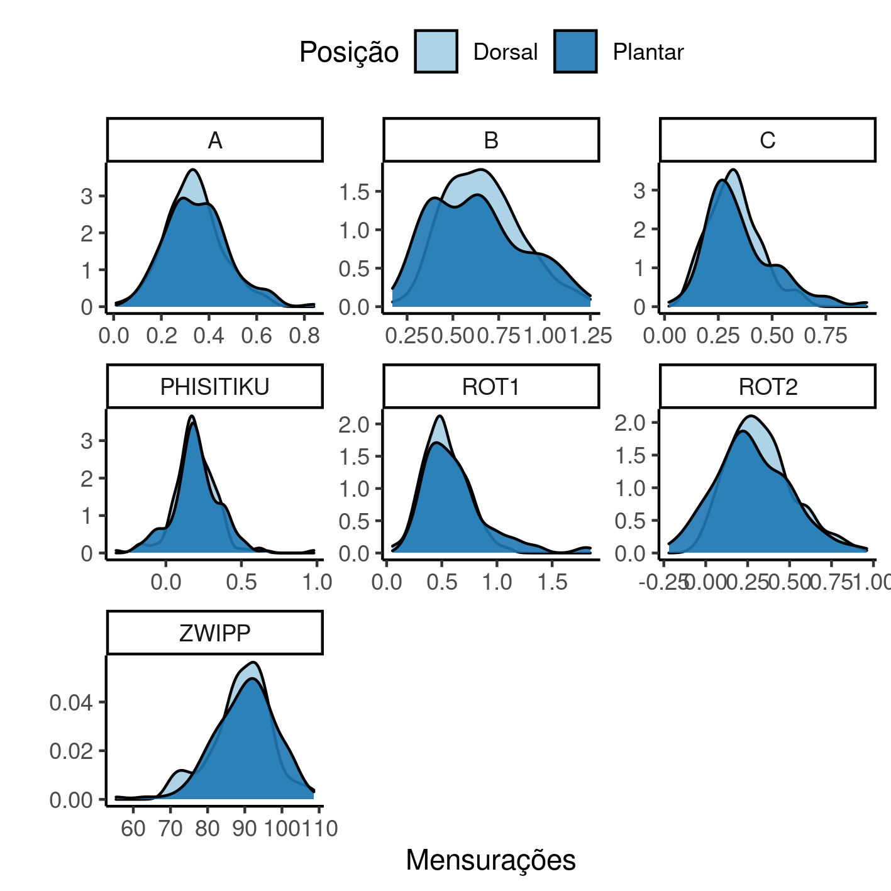

---

\newpage

**Consistência inter-avaliador de mensurações radiológicas para diagnóstico de sindesmose**

**Histórico do documento**

|Versão |Alterações     |
|:------|:--------------|
|01     |Versão inicial |

---

# Lista de abreviaturas

# Contexto

## Objetivos

## Recepção e tratamento dos dados

# Metodologia

## Parâmetros do estudo

### Desenho do estudo

### Critérios de inclusão e exclusão

### Exposições

### Desfechos

### Covariáveis

## Análises Estatísticas

Esta análise foi realizada utilizando-se o software `R` versão 4.1.3.

# Resultados

## População do estudo e acompanhamento

Ao todo 47 participantes foram incluídos no estudo.
Mensurações de cinco métricas foram realizadas em duas posições, plantar e dorsal (Tabela 1, Figura 1), por cinco avaliadores diferentes.
A partir das distâncias A e B as métricas Rotação 1 e Rotação 2 foram calculadas.

Table: **Tabela 1** Mensurações do estudo.

|          **Mensurações**           | **Dorsal**, N = 174 | **Plantar**, N = 174 |
|:----------------------------------:|:-------------------:|:--------------------:|
| Distância A, Média (Desvio Padrão) |     0.33 (0.12)     |     0.35 (0.13)      |
|            Desconhecido            |         11          |          10          |
| Distância B, Média (Desvio Padrão) |     0.66 (0.21)     |     0.63 (0.25)      |
|            Desconhecido            |         11          |          10          |
| Distância C, Média (Desvio Padrão) |     0.32 (0.12)     |     0.35 (0.16)      |
|            Desconhecido            |         11          |          10          |
|  Rotação 1, Média (Desvio Padrão)  |     0.53 (0.19)     |     0.62 (0.30)      |
|            Desconhecido            |         11          |          10          |
|  Rotação 2, Média (Desvio Padrão)  |     0.33 (0.19)     |     0.28 (0.22)      |
|            Desconhecido            |         11          |          10          |
|  Phisitiku, Média (Desvio Padrão)  |     0.20 (0.15)     |     0.20 (0.15)      |
|            Desconhecido            |         11          |          10          |
|    Zwipp, Média (Desvio Padrão)    |       89 (8)        |        90 (8)        |
|            Desconhecido            |         11          |          10          |

Table: **Tabela 2** Mensurações de cada avaliador.

|**Mensurações**                              | **Avaliador 1**, N = 36 | **Avaliador 2**, N = 34 | **Avaliador 3**, N = 32 | **Avaliador 4**, N = 36 | **Avaliador 5**, N = 36 |
|:--------------------------------------------|:-----------------------:|:-----------------------:|:-----------------------:|:-----------------------:|:-----------------------:|
|Distância A (plantar), Média (Desvio Padrão) |       0.42 (0.11)       |       0.35 (0.14)       |       0.35 (0.12)       |       0.38 (0.13)       |       0.26 (0.10)       |
|Desconhecido                                 |            7            |            0            |            2            |            0            |            1            |
|Distância A (dorsal), Média (Desvio Padrão)  |       0.41 (0.10)       |       0.33 (0.11)       |       0.31 (0.10)       |       0.36 (0.13)       |       0.28 (0.10)       |
|Desconhecido                                 |            8            |            0            |            2            |            0            |            1            |
|Distância B (plantar), Média (Desvio Padrão) |       0.78 (0.18)       |       0.71 (0.23)       |       0.45 (0.22)       |       0.79 (0.22)       |       0.43 (0.11)       |
|Desconhecido                                 |            7            |            0            |            2            |            0            |            1            |
|Distância B (dorsal), Média (Desvio Padrão)  |       0.78 (0.20)       |       0.72 (0.17)       |       0.64 (0.16)       |       0.75 (0.20)       |       0.46 (0.11)       |
|Desconhecido                                 |            8            |            0            |            2            |            0            |            1            |
|Distância C (plantar), Média (Desvio Padrão) |       0.33 (0.12)       |       0.32 (0.14)       |       0.53 (0.20)       |       0.33 (0.12)       |       0.28 (0.10)       |
|Desconhecido                                 |            7            |            0            |            2            |            0            |            1            |
|Distância C (dorsal), Média (Desvio Padrão)  |       0.34 (0.13)       |       0.33 (0.12)       |       0.33 (0.12)       |       0.33 (0.12)       |       0.29 (0.09)       |
|Desconhecido                                 |            8            |            0            |            2            |            0            |            1            |
|Rotação 1 (plantar), Média (Desvio Padrão)   |       0.55 (0.14)       |       0.52 (0.23)       |       0.88 (0.41)       |       0.51 (0.20)       |       0.64 (0.29)       |
|Desconhecido                                 |            7            |            0            |            2            |            0            |            1            |
|Rotação 1 (dorsal), Média (Desvio Padrão)    |       0.54 (0.13)       |       0.47 (0.17)       |       0.50 (0.20)       |       0.50 (0.21)       |       0.62 (0.22)       |
|Desconhecido                                 |            8            |            0            |            2            |            0            |            1            |
|Rotação 2 (plantar), Média (Desvio Padrão)   |       0.36 (0.16)       |       0.36 (0.22)       |       0.10 (0.20)       |       0.41 (0.23)       |       0.17 (0.12)       |
|Desconhecido                                 |            7            |            0            |            2            |            0            |            1            |
|Rotação 2 (dorsal), Média (Desvio Padrão)    |       0.38 (0.17)       |       0.39 (0.17)       |       0.33 (0.16)       |       0.39 (0.23)       |       0.18 (0.11)       |
|Desconhecido                                 |            8            |            0            |            2            |            0            |            1            |
|Phisitiku (plantar), Média (Desvio Padrão)   |       0.21 (0.15)       |       0.20 (0.15)       |       0.27 (0.15)       |       0.23 (0.10)       |       0.11 (0.15)       |
|Desconhecido                                 |            7            |            0            |            2            |            0            |            1            |
|Phisitiku (dorsal), Média (Desvio Padrão)    |       0.19 (0.11)       |       0.15 (0.15)       |       0.32 (0.19)       |       0.21 (0.09)       |       0.12 (0.11)       |
|Desconhecido                                 |            8            |            0            |            2            |            0            |            1            |
|Zwipp (plantar), Média (Desvio Padrão)       |         85 (11)         |         92 (8)          |         92 (7)          |         91 (7)          |         91 (7)          |
|Desconhecido                                 |            7            |            0            |            2            |            0            |            1            |
|Zwipp (dorsal), Média (Desvio Padrão)        |         84 (8)          |         91 (7)          |         91 (8)          |         91 (8)          |         88 (7)          |
|Desconhecido                                 |            8            |            0            |            2            |            0            |            1            |

**Figura 1** Distribuição de densidade das mensurações do estudo.

## Análise inferencial

Table: **Tabela 3** caption

|**Mensurações**                    | **Dorsal**, N = 163 | **Plantar**, N = 163 | **Valor p** |
|:----------------------------------|:-------------------:|:--------------------:|:-----------:|
|Rotação 1, Média (Desvio Padrão)   |     0.53 (0.19)     |     0.62 (0.30)      |   <0.001    |
|Rotação 2, Média (Desvio Padrão)   |     0.33 (0.19)     |     0.28 (0.23)      |    0.004    |
|Distância C, Média (Desvio Padrão) |     0.32 (0.12)     |     0.35 (0.16)      |    0.011    |
|Phisitiku, Média (Desvio Padrão)   |     0.20 (0.15)     |     0.20 (0.15)      |    0.597    |
|Zwipp, Média (Desvio Padrão)       |       89 (8)        |        90 (8)        |    0.076    |

|   Métrica   | ICC  |      IC       | Valor p |
|:-----------:|:----:|:-------------:|:-------:|
| Distância C | 0.29 | [0.16, 0.49]  | <0.001  |
|  Rotação 1  | 0.09 | [0.01, 0.23]  |  0.008  |
|  Rotação 2  | 0.23 | [0.11, 0.41]  | <0.001  |
|  Phisitiku  | 0.31 | [0.18, 0.50]  | <0.001  |
|    Zwipp    | 0.02 | [-0.03, 0.13] |   0.2   |

Table: **Tabela 4** caption

# Observações e limitações

# Conclusões

# Referências

- **SAP-2022-012-IC-v01** -- Plano Analítico para Consistência inter-avaliador de mensurações radiológicas para diagnóstico de sindesmose

# Apêndice

## Análise exploratória de dados

## Disponibilidade

Todos os documentos gerados nessa consultoria foram incluídos no portfólio do consultor.

<!-- O cliente solicitou que esta análise seja mantida confidencial até uma futura data, determinada pelo próprio cliente. -->
<!-- Todos os documentos gerados nessa consultoria portanto não foram publicados online e apenas o título e o ano da análise foram incluídas no portfólio do consultor. -->
<!-- Após a data acordada, os documentos serão disponibilizados. -->

<!-- O cliente solicitou que esta análise seja mantida confidencial. -->
<!-- Todos os documentos gerados nessa consultoria portanto não foram publicados online e apenas o título e o ano da análise foram incluídas no portfólio do consultor. -->

O portfólio pode ser visto em:

<https://philsf-biostat.github.io/SAR-2022-012-IC/>

## Dados utilizados

A tabela A1 mostra a estrutura  da tabela de dados analíticos.

| id  | avaliador | posicao | a | b | c | rot1 | rot2 | phisitiku | zwipp |
|:---:|:---------:|:-------:|:-:|:-:|:-:|:----:|:----:|:---------:|:-----:|
|  1  |           |         |   |   |   |      |      |           |       |
|  2  |           |         |   |   |   |      |      |           |       |
|  3  |           |         |   |   |   |      |      |           |       |
| ... |           |         |   |   |   |      |      |           |       |
|  N  |           |         |   |   |   |      |      |           |       |

Table: **Tabela A1** Estrutura da tabela de dados analíticos

Os dados utilizados neste relatório não podem ser publicados online por questões de sigilo.
